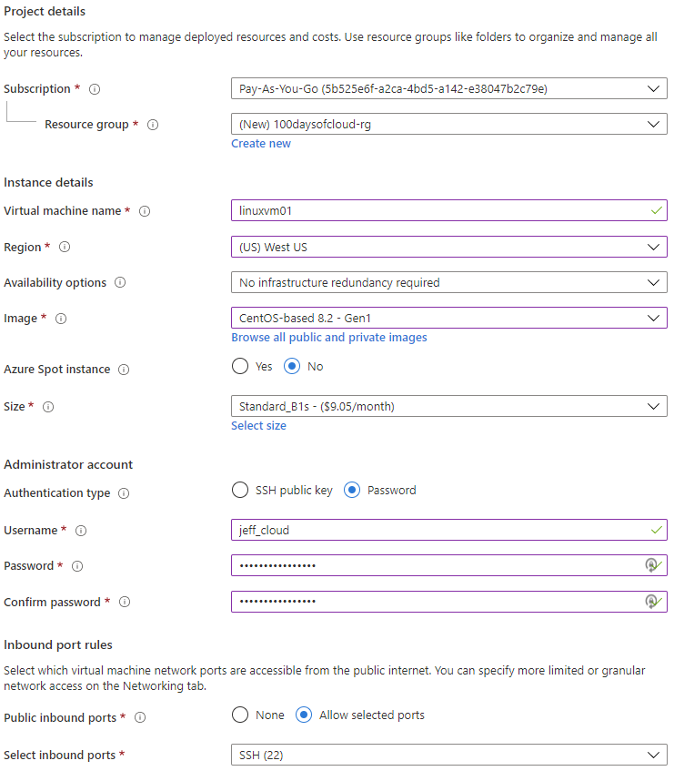
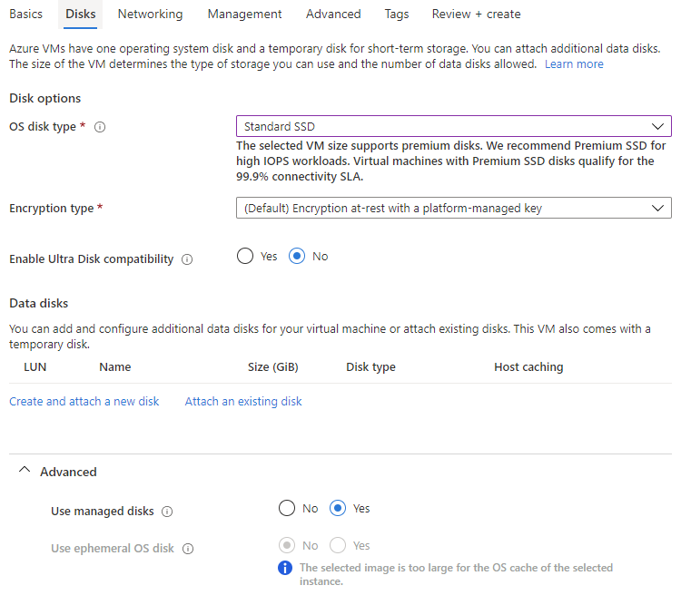
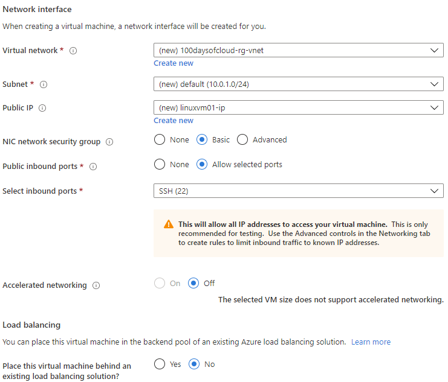
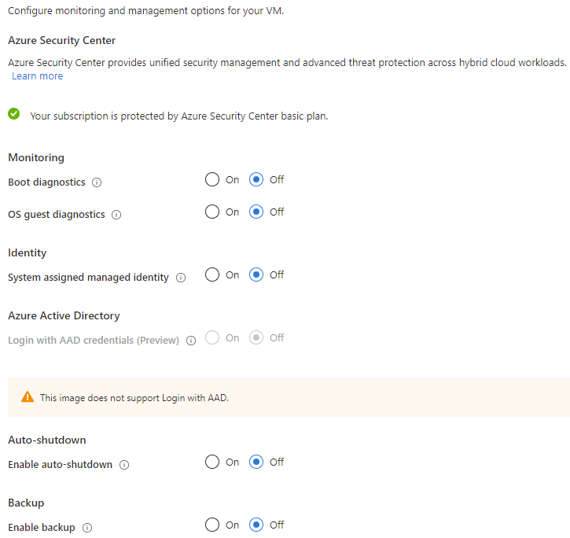
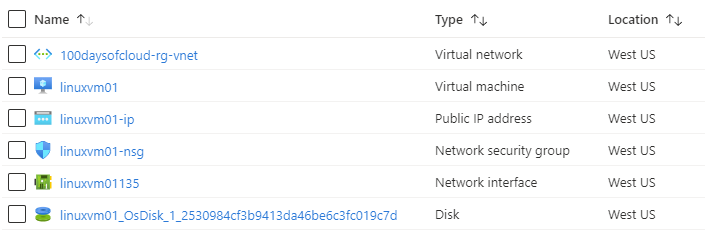

## Introduction

I'm currently studying for the LPI Linux Essentials exam. I've always been a Microsoft guy, but working in the cloud means knowing multiple operating systems. I'm going to deploy a Linux VM in Azure to work with and get to know the Linux operating system.

## Prerequisite

An Azure subscription and enough administrator permissions to deploy resource groups, virtual networks, and virtual machines.

## Instructions

Navigate to [https://portal.azure.com](https://portal.azure.com) and log in with your administrator account. On the portal homepage, click **Create a resource**, select **Compute**, then **Virtual machine**.

In the **Basic** tab of the wizard, fill out the following information:

- Select the Subscription to charge the cost of resources against
- Select an existing resource group or create a new one
- Name the virtual machine
- Select a region to host the virtual machine and its resources
- For availability options, this is just a demo virtual machine, so no redundancy is required
- For the image, I'm going to select CentOS, but you can choose any operating system you need
- Select **No** for the Azure Spot instance
- For the size, choose something small to limit the cost of the virtual machine, so I'm going with B1s for 1 core and 1GB RAM
- Now it's time to set up the Administrator account. For now, I'm going to use a password to authenticate to my Linux VM, but in the future I need to dabble with SSH keys.
- Finally, choose inbound port rules. Typically you don't want virtual machines to have direct Internet access, but this VM won't be online all the time and it won't have anything sensitive on it. I'll choose to all SSH on port 22 so I can remote directly to it.

Overview of basic configuration:



Continue onto the **Disks** tab. Here we'll keep it simple. I'll change the OS Disk Type to **Standard SSD** just to save a bit on storage costs versus the premium SSD option. If you expand the Advanced settings, keep the option to use managed disks. This way you don't need to manage the disks in storage accounts manually and keep track of available storage and IOPS.

Overview of disks configuration:



Continue onto the **Networking** tab. Since I don't have any existing virtual networks, I'm going to keep this all at the defaults, including a public IP address so I can access my virtual machine directly over the Internet. Typically not a best practice, but again, this VM is for learning purposes, so I'm not getting fancy yet.

Overview of network configuration:



Continue onto the **Management** tab. I will make one small change here and that is to disable boot diagnostics. This setting will capture serial console output and take screenshots of the virtual machine to help diagnose startup issues. However, this requires a storage account for storing these log files and images, so I want to skip this for now.

Overview of management configuration:


Finally, for the **Advanced** tab, there is nothing to configure here for now. Might get into extensions or custom data liking passing a configuration script, but for now I'm good (and no screenshot being included here). The same goes for the **Tags** tab. For real production workloads, you would want to tag the virtual machine as *prod* or *dev* or maybe associate it with a department for billing purposes.

Skip over to the **Review + create** tab and verify it passes validation. If it does, select **Create** at the bottom. Once the deployment is complete, go back to the newly created resource group and see the different resources created:

- Virtual network that currently has a single subnet configured
- The virtual machine compute resource
- Public IP address for the virtual machine
- Network security group that currently allows port 22 for SSH
- A separate network interface that attaches to the virtual network
- Operating system disk



Selecting the virtual machine, in the top overview section there will be the current public IP address so I can connect to the virtual machine directly. Here it is **13.83.82.96**:


I could select the Connect button and it will give me instructions on connecting to the virtual machine with a private key. Right now I don't have one generated, so instead I'm going to jump out to PowerShell and use the built-in SSH client to connect to the virtual machine. The syntaxt is:

```powershell
ssh <user name>@<ip address>
```


The first time you log onto a Linux VM, there will be a warning about adding the server fingerprint to a list of known hosts. I'm OK with this, so I enter "yes" and then the password I created back on the **Basics** tab when creating the virtual machine.

## Next Steps

If you're paying for this Azure subscription yourself and to avoid excess charges, I would suggest deleting the virtual machine, the public IP address, and the disk. The virtual network components can stay as I don't think they cost anything when not being used.

So instead of buiding a virtual machine manually like this, wouldn't it be nice if there was a faster way to deploy it? I think next time I'll look at deploying it using an ARM template to speed up the process.

## Social Proof

[Twitter](https://twitter.com/JeffWBrown/status/1298105256341934082?s=20)
[LinkedIn](https://www.linkedin.com/posts/jeffwaynebrown_jeffbrowntech100daysofcloud-activity-6703871248100925440-xtcn)
