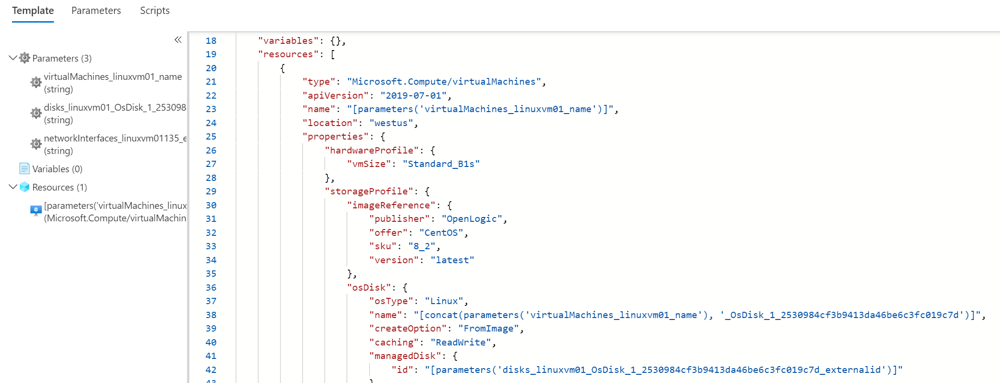

**Add a cover photo like:**

## Introduction

Yesterday I walked through creating a virtual machine in Azure. However, manually going through the portal is probably OK for a one-off resource, but I want an easier way to deploy this virtual machine quickly. Enter Azure Resource Manager or ARM templates.

## Prerequisite

Need an Azure subscription and an example resource to export the ARM template.

## Instructions
Let's go back and look at the VM deployed yesterday. On the right menu under **Settings** there is an **Export template** option. This will bring up a long JSON formatted file that defines the current resource, in this case a virtual machine.

The main thing I want to focus on is the **resources** section. In here we are defining what resources (virtual machine size, disk, operating system, etc.) that we want to deploy. This template file is specific to this resource, so we see references to the size, image or operating system, and admin user name. This all matches what we used yesterday when we created the VM in the portal using the wizard.

Let's click the download button and save the template (mine will be saved in the [*linuxvm01-exported-template folder*](./linuxvm01-exported-template)). It will have two JSON files:
- template.json : this is what we were just viewing in the portal; it has the VM resource definitions
- parameters.json : this contains parameter information that we can pass to the template.json file

So let's go through trying to deploy this template back into Azure. Back on the Azure portal home page, click on **Create a resource** and search for *Template deployment*, select the matching result, and click **Create**.

In the **Select a template** menu, click on *Build your own template in the editor*. In the **Edit template** window, click on **Load file** and 

## Next Steps

✍️ Describe what you think you think you want to do next.

## Social Proof

✍️ Show that you shared your process on Twitter or LinkedIn

[link](link)
