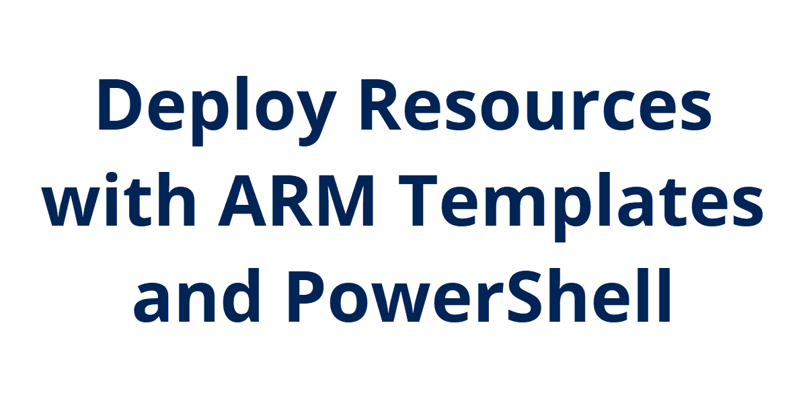
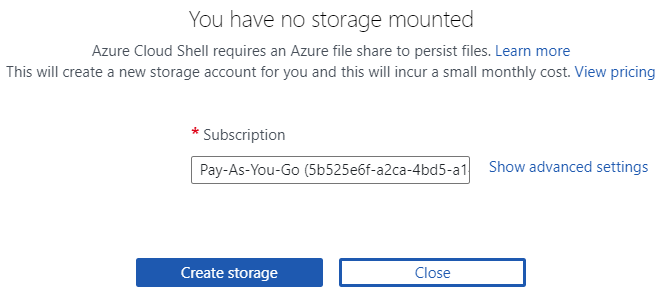
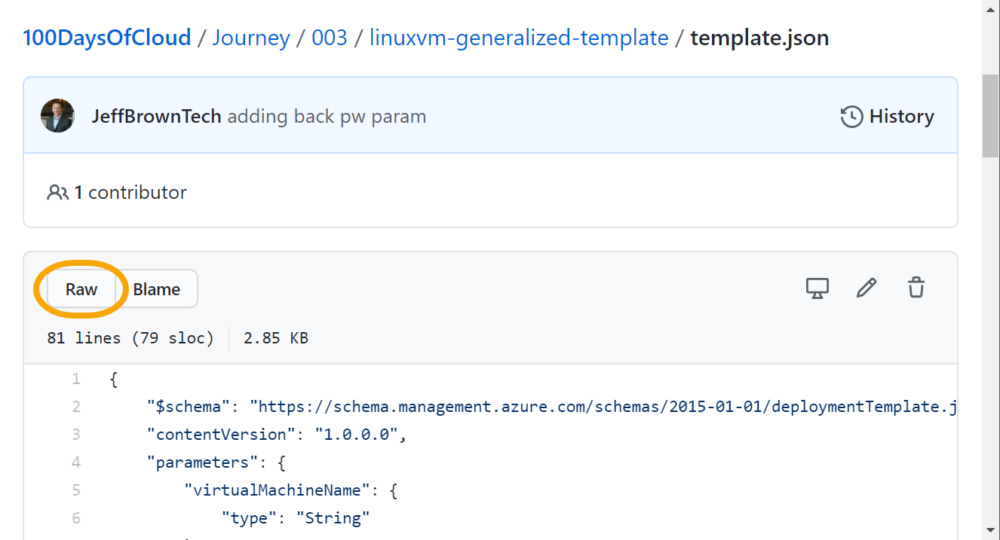

**Add a cover photo like:**


## Introduction

So now we have an ARM template to quickly deploy a virtual machine. However, I still had to go through the portal and make a bunch of clicks in order to make it happen. Let's do the same thing using PowerShell.

## Prerequisite

Azure subscription and an ARM template.

## Instructions

This could also be done in Azure CLI, but I'm more familiar with PowerShell, so we'll go with that. Neither is right or wrong, but find the one that works for you.

The quickest way to get started is there is a built-in cloud shell in the Azure portal. This is helpful as you don't have to make sure PowerShell is up-to-date or install a module to work with Azure resources. It's all built in.

You can get to the cloud shell by clicking the cloud shell icon in the upper right corner of the Azure portal:


If this is the first time opening the cloud shell, you'll get a prompt that there is no storage mounted. Azure Cloud Shell requires an Azure file share to host the profile. This takes up minimal storage and cost per month.

In the drop down, select the subscription to bill the resources against, then click **Create storage**. This will automatically name everything for you.



If you're picky and specific like me, you want to name all the things. Instead, click on **Show advanced settings** and you are presented with some options. You can specify the region to host it in, a resource group, the storage account name (which must be globally unique across Azure), and the file share name, or use existing ones if they are available.


This will go through and provision all the requirements to use the cloud shell. You can switch between PowerShell and Bash console using the drop down in the upper right of the shell window. For now mine will be set to PowerShell.

For reference, I'll be using the [instructions found here on Microsoft Docs](https://docs.microsoft.com/en-us/azure/azure-resource-manager/templates/deploy-powershell) for deploying the template I built yesterday. What's great is I don't even have to download the templateljson file. I can reference it directly in GitHub to deploy it. I'll need the link to the raw text of the template.json in today's folder. When viewing a file in GitHub, select the Raw button and copy the URL there:



The URL for today's template is here:

https://raw.githubusercontent.com/JeffBrownTech/100DaysOfCloud/main/Journey/003/linuxvm-generalized-template/template.json

I'm going to save this to a variable so I don't have to keep pasting the long URL again and again. I'll also need the resource group name to deploy to, so I'll save that into a variable first, then attempt the deployment using the **New-AzResourceGroupDeployment** command:

```powershell
$linuxTemplateUri = "https://raw.githubusercontent.com/JeffBrownTech/100DaysOfCloud/main/Journey/003/linuxvm-generalized-template/template.json"

$100daysrg = "100daysofcloud-rg"

New-AzResourceGroupDeployment -ResourceGroupName $100daysrg -TemplateUri $linuxTemplateUri
```

Now remember back when I deployed this in the portal, I had to provide information like the virtual machine name and admin password. Here in PowerShell I'm going to get the same thing, it will prompt for these values:


When I tried this, I got the following error:

```
New-AzResourceGroupDeployment: 10:33:58 PM - Error: Code=InvalidTemplate; Message=Deployment template validation failed: 'Template parameter JToken type is not valid. Expected 'String, Uri'. Actual 'Object'. Please see https://aka.ms/resource-manager-parameter-files for usage details.'.
```

From what I read on forums, it doesn't like passing the password secure string to the ARM template and runs into an error. As a test, I removed the password parameter and tried to deploy. It was fine up until it errored that there was no admin password defined for the VM, confirming my suspicion.

I also tried to store the password as a secure string password:

```powershell
$plainPassword = "P@ssw0rd123!"

$securePassword = ConvertTo-SecureString -String $plainPassword -AsPlainText -Force
```

And tried specifying this value for the parameter. Something I did learn, you can add parameters in the JSON file as parameters for the PowerShell command:

```powershell
New-AzResourceGroupDeployment -ResourceGroupName $100daysrg -TemplateUri $linuxTemplateUri -virtualMachineName "linuxvm03" -vmAdminPassword $securePassword
```

But still the same error. Tried building a hash table of the parameter values:

```powershell
$paramHash = @{ virtualMachineName = "linuxvm03"; vmAdminPassword = $securePassword }

New-AzResourceGroupDeployment -ResourceGroupName $100daysrg -TemplateUri $linuxTemplateUri -TemplateParameterObject $paramHash
```

But still the same error. It seems that there's not a good way to pass secrets like this when using the ARM template. So the best solution I can find tonight is to specify the value in the [parameters.json file](https://raw.githubusercontent.com/JeffBrownTech/100DaysOfCloud/main/Journey/003/linuxvm-generalized-template/parameters.json) like so:

```json
{
    "$schema": "https://schema.management.azure.com/schemas/2015-01-01/deploymentParameters.json#",
    "contentVersion": "1.0.0.0",
    "parameters": {
        "virtualMachineName": {
            "value": "linuxvm03"
        },

        "vmAdminPassword": {
            "value": "P@ssw0rd123!"
        }
    }
}
```

I'll save the parameters.json raw file URL to a variable and retry the command like this:

```powershell
$parameterUri = "https://raw.githubusercontent.com/JeffBrownTech/100DaysOfCloud/main/Journey/003/linuxvm-generalized-template/parameters.json"

New-AzResourceGroupDeployment -ResourceGroupName $100daysrg -TemplateUri $linuxTemplateUri -TemplateParameterUri $parameterUri
```

And this was successful but not ideal. The password for the virtual machine is stored in plain text, and in this case, available out in a public repo. So I'll have to investigate more to see if I can specify the password another way (besides integrating with key vault, which may be what I try next).

But I did learn a few things, like being able to specify the template.json parameters as parameters for the New-AzResourceGroupDeployment command. Also just building a hash table to provide the parameter values. Good to know the different options for specifying parameters in the template.json file.

## Next Steps

I need to work on this template some more to add a public IP address and a network security group with a rule to allow SSH on port 22 so I can connect to it over the Internet.

## Social Proof

✍️ Show that you shared your process on Twitter or LinkedIn

[Twitter](link)
[LinkedIn](link)
