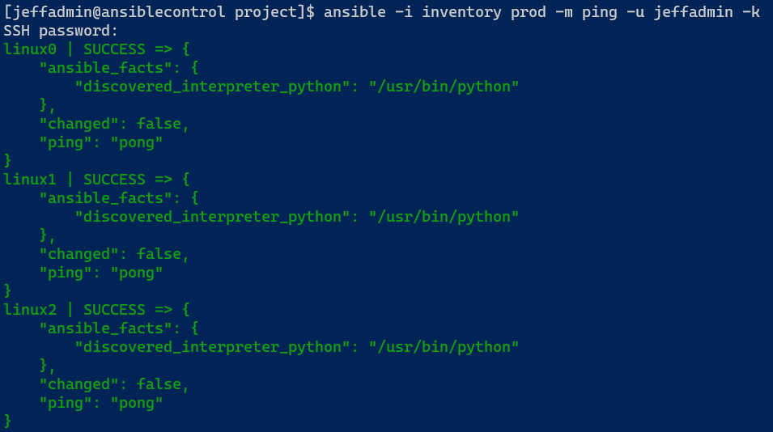
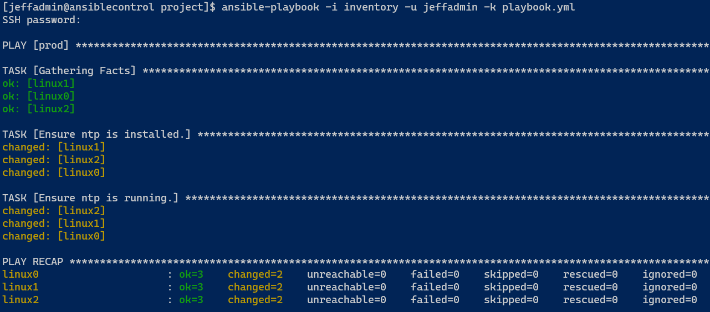
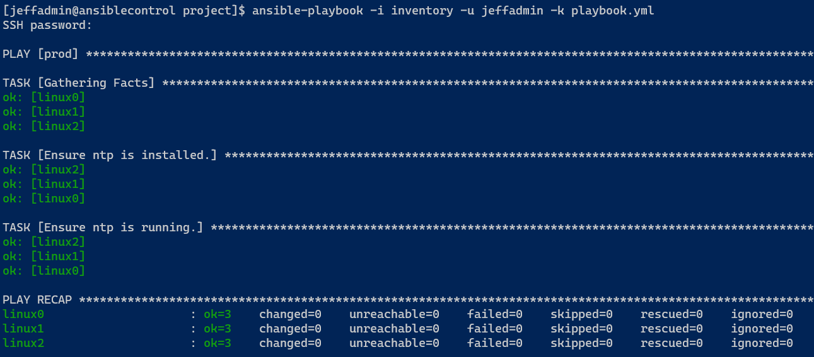

## Introduction

Moving on from deploying resources using ARM templates, I'm going to start learning Ansible. I did a brief intro with this technology last year but didn't progress on it, so looking forward to diving back into it. I also have a work project that requires using Ansible, so excited that I have a practical application for it.

## Prerequisite

A Linux server to install Ansible on, and another Linux server to use to push configurations to.

## Use Case

Ansible is used to configure multiple servers that exact same way using individual commands or a playbook. It doesn't have to necessary do any configuration either, it can just query and gather information from a selection of hosts.

# Instructions

I decided to start with [Jeff Geerling's Ansible 101 YouTube playlist](https://www.youtube.com/playlist?list=PL2_OBreMn7FqZkvMYt6ATmgC0KAGGJNAN). I had it bookmared for awhile along with purchasing his book [Ansible for DevOps](https://leanpub.com/ansible-for-devops). I thought the one hour videos would be a good introduction, then I could dive into the book. What I didn't know was the 101 series is him going through the chapters of the book, so I've decided to watch 1-2 of the videos to watch the demos, then go back and read those chapters of the book. So this day of cloud is based on the first two chapters of the book and video series.

Using my [ansible-lab](https://github.com/JeffBrownTech/ansible-lab) ARM template, I deployed the resources out into Azure. This lab contains the server 'ansiblecontrol' to use to host playbooks and push out configurations to my three Linux VMs (linux0, linux1, linux2).

I SSH'ed into ansiblecontrol and installed the ansible software package. I had to install EPEL's RPM before I could install Ansible on this CentOS 7 server:

```bash
sudo yum -y install epel-release

sudo yum -y install ansible
```

After installing Ansible, I made sure I could connect to each of my other Linux VMs using SSH and the admin password. Ideally I would use SSH keys, but that is actuall a topic I'm not 100% knowledgeable on, so I need to read up on that and how to maybe incorporate one saved in my Azure key vault.

I created a 'project' folder in my user directory and created a file named 'inventory' in there. I put each of the server names in my lab environment under as a group named 'prod'. Here's what the file looks like:


Next I can run ad-hoc ansible commands against the servers in this inventory file using the 'ansible' command:

```bash
ansible -i inventory prod -m ping -u jeffadmin -k
```

- -i inventory prod : specifies to look at the 'inventory' file in this directory and to target the 'prod' group of hosts
- -m ping : specifies to use the ping module from Ansible
- -u jeffadmin : specifies to use the 'jeffadmin' user to connect
- -k : specifies to use a password instead of an SSH key

The results show each of the linux0|1|2 servers responses from the ping command:



Instead of using *-m <module name>* to use an Ansible module, I can also use the *-a* arguments parameter to pass shell commands, like "free -h" to show RAM usage or "df -h" to show disk usage:


Instead of singular commands or modules, I can write a playbook that outlines multiple configuration options. Here's the playbook.yml file for targeting the prod hosts in the inventory file:


I specified the hosts to target from the inventory file ("prod"), the use of become for root/sudo access, and a lists of tasks. This is to ensure the ntp software package is installed using the yum module from Ansible, and to make sure the service is running and enabled.

This time I used the *ansible-playbook* command to specify the inventory file but not the group as the playbook definition says to target the "prod" group, the "jeffadmin" use account, and the playbook.yml file:

```bash
ansible-playbook -i inventory -u jeffadmin -k playbook.yml
```



Under the second and third tasks, the status is orange/changed, meaning the playbook made changes to the hosts. In this case, it installed the ntp package and made sure it is running. If I run the playbook again, it's all green as nothing needed to change on the hosts:



I then SSH'ed into linux1 and stopped the ntpd service. Running the playbook again, it detects this configuration drift and starts the service back up:


## Next Steps

I'll continue working through the YouTube series and book. Once I get a good feel for the basics, I want use Ansible to deploy Azure resources instead of using ARM templates.

## Social Proof

[Twitter](https://twitter.com/JeffWBrown/status/1302814909340606464?s=20)
[LinkedIn](https://www.linkedin.com/posts/jeffwaynebrown_jeffbrowntech100daysofcloud-activity-6708580664490500096-ZGL0)
